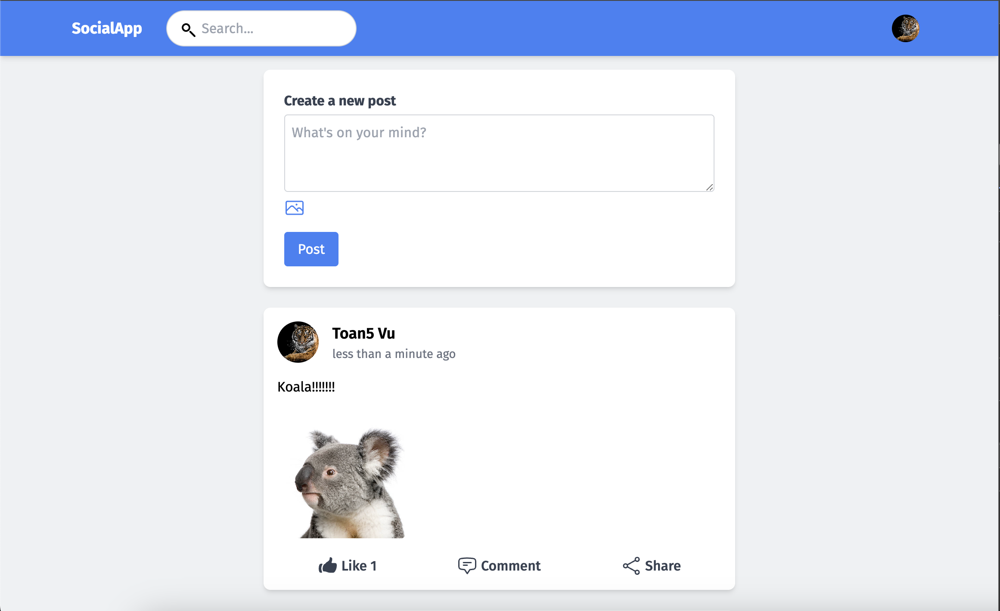

# Social Media App

## Overview

This is a simple social media application built with React and Redux for the frontend and Node.js with Express and MongoDB for the backend. The application allows users to register, login, create posts, like posts, comment on posts, and view user profiles. Tailwind CSS is used for styling, ensuring a responsive and modern design.



## Features

- User Authentication: Register and login functionality with JWT-based authentication.
- User Profiles: View user profiles with profile pictures, bios, and other details.
- Posts: Create, like, comment on, and view posts.
- Responsive Design: Tailwind CSS ensures the app is responsive and mobile-friendly.

## Tech Stack

### Frontend

- React: JavaScript library for building user interfaces.
- Redux: State management for React applications.
- Tailwind CSS: Utility-first CSS framework for styling.
- Heroicons: Icons for the UI components.

### Backend

- Node.js: JavaScript runtime for building server-side applications.
- Express: Web framework for Node.js.
- MongoDB: NoSQL database for storing user data and posts.
- Mongoose: ODM for MongoDB and Node.js.
- Multer: Middleware for handling file uploads.
- JWT: JSON Web Tokens for authentication.

## Getting Started

### Prerequisites

- Node.js and npm installed on your local machine.
- MongoDB server running locally or a MongoDB Atlas account.

### Installation

1. Clone the repository:

```bash
git clone https://github.com/yourusername/social-media-app.git
cd social-media-app
```

2. Install dependencies for both frontend and backend:

```bash
# Install frontend dependencies
cd front-end
npm install

# Install backend dependencies
cd ../back-end
npm install
```

### Configuration

1. Create a `.env` file in the `back-end` directory and add the following environment variables:

```plaintext
MONGO_URL=your_mongodb_connection_string
JWT_SECRET=your_jwt_secret
PORT=3001
```

### Running the Application

1. Start the backend server:

```bash
cd back-end
npm start
```

2. Start the frontend development server:

```bash
cd ../front-end
npm start
```

3. Open your browser and navigate to `http://localhost:3000`.

## Project Structure

### Frontend (`front-end`)

- `src/components`: React components for the application.
- `src/pages`: Page components representing different routes.
- `src/state`: Redux state management setup.
- `src/assets`: Static assets like images and icons.

### Backend (`back-end`)

- `routes`: Express routes for authentication, user, and posts.
- `controllers`: Controllers handling business logic for each route.
- `models`: Mongoose models for MongoDB collections.
- `middleware`: Custom middleware for authentication and file uploads.

## Important Files

### Frontend

- `src/index.js`: Entry point for the React application.
- `src/App.js`: Main application component.
- `src/components/NavBar.js`: Navigation bar component.
- `src/components/SideBar.js`: SideBar component.
- `src/pages/HomePage.js`: Home page component.
- `src/state/state.js`: Redux slice for state management.

### Backend

- `index.js`: Entry point for the Node.js server.
- `routes/authRoutes.js`: Routes for user authentication.
- `routes/userRoutes.js`: Routes for user profile management.
- `routes/postRoutes.js`: Routes for creating, liking, and commenting on posts.
- `controllers/authController.js`: Controller for authentication logic.
- `controllers/userController.js`: Controller for user profile logic.
- `controllers/postController.js`: Controller for post-related logic.
- `models/User.js`: Mongoose model for user data.
- `models/Post.js`: Mongoose model for post data.

## License

This project is licensed under the MIT License.
